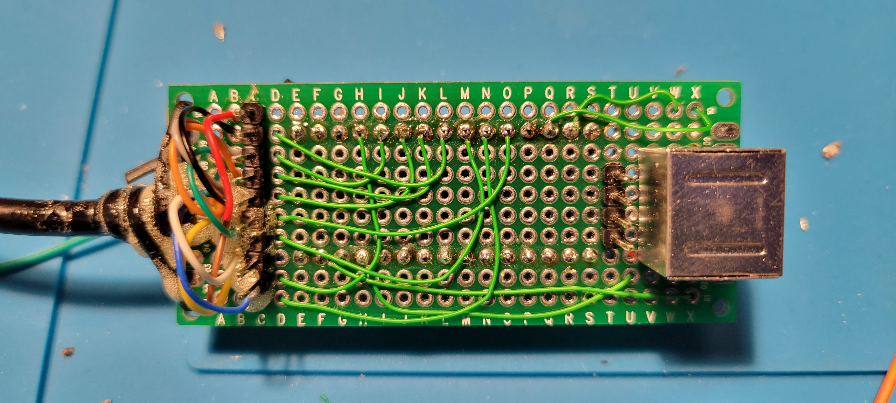

# Amiga-PS2-Mouse-Adapter

Arduino based PS2 mouse to Amiga adapter

The code in this version is configured to connect to an Arduino as follows:

* PS2 MOUSE_DATA    -> Arduino D11
* PS2 MOUSE_CLOCK   -> Arduino D10
* Amiga MOUSE_X0    -> Arduino D2
* Amiga MOUSE_X1    -> Arduino D3
* Amiga MOUSE_Y0    -> Arduino D4
* Amiga MOUSE_Y1    -> Arduino D5
* Amiga L_BUTTON    -> Arduino D6
* Amiga R_BUTTON    -> Arduino D7
* Amiga M_BUTTON    -> Arduino D8

The configuration can easily be changed to someone elses liking, the definitions are towards the top of the file.

Here is a sample implementation based on the Arduino Nano. On the left you can see the cannibalized 9 pin to Amiga cable. It is a regular joystick cable with all 9 pins passed through.

The silver box on the right is the PS2 mouse port.

In this picture you can see the Arduino Nano I used for my implementation.

